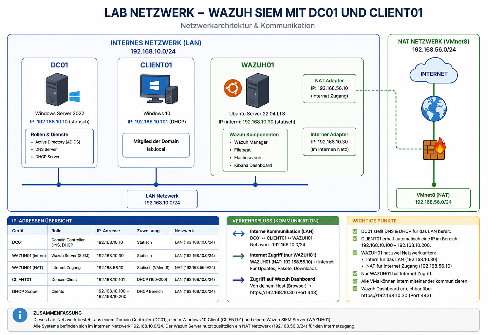

# Active Directory Home Lab

## Übersicht

Dieses Projekt dokumentiert den Aufbau einer vollständigen Active Directory Testumgebung mit Windows Server 2022.

## Ziel des Projekts

Ziel dieses Projekts war es, praktische Erfahrungen im Bereich Windows Server Administration, Netzwerkdienste und IT-Infrastruktur zu sammeln.

Dabei standen insbesondere folgende Themen im Fokus:

- Active Directory Domain Services (AD DS)
- Benutzer- und Rechteverwaltung
- Gruppenrichtlinien (GPO)
- Fileserver-Verwaltung
- DHCP
- Netzwerk- und Clientverwaltung
- Security Monitoring
- Zugriffskontrolle und Sicherheitsrichtlinien

Das Projekt dient außerdem als praktische Vorbereitung auf Tätigkeiten im Bereich:
- IT Support
- Systemadministration
- Cybersecurity

Die gesamte Umgebung wurde in VirtualBox virtualisiert und orientiert sich an typischen Unternehmensstrukturen.

---

# Verwendete Technologien

* Windows Server 2022
* Windows 10 Pro
* Ubuntu Server 24.04 LTS
* Active Directory Domain Services (AD DS)
* DNS
* DHCP
* NTFS-Berechtigungen
* Group Policy Management
* VirtualBox
* Wazuh
* Sysmon 

---

# Netzwerkstruktur

| Gerät    | Funktion                              | IP-Adresse         |
| -------- | ------------------------------------- | ------------------ |
| DC01     | Domain Controller / DNS / DHCP        | 192.168.10.10      |
| CLIENT01 | Domänen-Client                        | DHCP               |
| WAZUH01  | Wazuh Server / Security Monitoring    | 192.168.10.30      |
| Domain   | firma.local                           |                    |

---

# Projektstruktur

## Teil 1 – Active Directory & Domain Controller

In diesem Teil wurde eine vollständige Active Directory Domäne aufgebaut.

### Inhalte

* Installation von Windows Server 2022
* Einrichtung von Active Directory Domain Services (AD DS)
* DNS-Konfiguration
* Erstellung der Domäne `firma.local`
* Benutzer- und Gruppenverwaltung
* Organizational Units (OU)
* Group Policies (GPO)
* Domain Join eines Windows-Clients

📄 Dokumentation:

* `Teil-1-Active-Directory/Active Directory Lab Teil 1.pdf`

---

## Teil 2 – Fileserver & Berechtigungsverwaltung

In diesem Teil wurde ein zentraler Windows-Fileserver innerhalb der Domäne eingerichtet.

### Inhalte

* Erstellung von Netzwerkfreigaben
* Share Permissions
* NTFS-Berechtigungen
* Sicherheitsgruppen
* Zugriffstests
* Automatische Netzlaufwerke über GPOs

📄 Dokumentation:

* `Teil-2-File-Server/Active Directory Lab Teil 2 Fileserver und Berechtigungsverwaltung.pdf`

---

## Teil 3 – DHCP Server Configuration

In diesem Teil wurde ein DHCP-Server eingerichtet und getestet.

### Inhalte

* Installation der DHCP-Rolle
* DHCP-Autorisierung
* Erstellung eines IPv4-Scopes
* Gateway- und DNS-Konfiguration
* Automatische IP-Adressvergabe
* DHCP-Tests mit Windows-Clients

📄 Dokumentation:

* `Teil-3-DHCP-Server/Active Directory Lab Teil 3 DHCP Server Configuration.pdf`

---

## Teil 4 – Wazuh & Sysmon Security Monitoring

In diesem Teil wurde ein grundlegendes SIEM- und Security Monitoring System aufgebaut.

Die Umgebung basiert auf einem Ubuntu Server mit installiertem Wazuh Manager sowie einem Windows Client mit Wazuh Agent und Sysmon zur Überwachung von Sicherheitsereignissen.

Zusätzlich wurde eine kombinierte Netzwerkstruktur aus Internal-Network und NAT eingerichtet, um sowohl interne Kommunikation innerhalb des Labors als auch Internetzugriff für Installation und Updates zu ermöglichen.

### Inhalte

* Installation von Ubuntu Server 24.04 LTS
* Netzwerkkonfiguration mit Internal Network und NAT
* Einrichtung statischer und dynamischer IP-Konfigurationen
* Installation von Wazuh
* Deployment des Wazuh Agents auf Windows
* Installation und Konfiguration von Sysmon
* Windows Event Monitoring
* Log Collection und Analyse
* Erstellung eigener Wazuh-Regeln
* PowerShell Event Detection
* Security Alert Monitoring
* Threat Hunting mit Wazuh

📄 Dokumentation:

* `Teil-4-Wazuh-Sysmon/Wazuh & Sysmon Security Monitoring.pdf`

---

# Netzwerkdiagramm

---
# Autor

ZhDiTech
